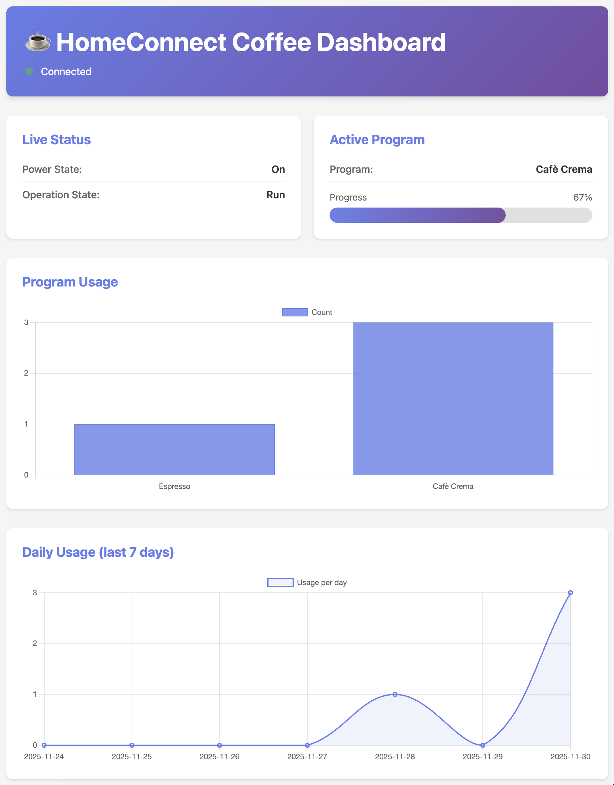

# HomeConnect Coffee Control

[](https://github.com/pommes/HomeConnectCoffee/actions/workflows/tests.yml)
[](https://github.com/pommes/HomeConnectCoffee/releases/latest)
[](https://www.python.org/)
[](LICENSE)
[](https://github.com/pommes/HomeConnectCoffee/stargazers)
[](https://github.com/pommes/HomeConnectCoffee/network/members)

This project demonstrates how to start your Bosch CTL7181B0 (and other HomeConnect coffee machines) via Python script using the official HomeConnect Cloud API.



## Prerequisites

1. **HomeConnect Developer Account** at [developer.home-connect.com](https://developer.home-connect.com)
2. **OAuth Client** (Type *Server Application*) with Redirect URL `http://localhost:3000/callback` or similar
3. **Device linked** (via the HomeConnect app)
4. Python 3.11+

## Setup

### 1. Register Application with Home Connect

1. Go to [developer.home-connect.com/applications](https://developer.home-connect.com/applications)
2. Click **"Register Application"** or **"New Application"**
3. Fill out the form:
   - **Application ID**: e.g., "HomeConnect Coffee Control"
   - **OAuth Flow**: Select **"Authorization Code Grant flow"** (not "Device Flow")
   - **Home Connect User Account for Testing**: **Leave empty** – If you have set the account in your profile (email address), it will be used automatically. Only fill this in if you want to use a different test account for this specific application.
   - **Redirect URI**: `http://localhost:3000/callback`
   - **Scopes**: Requested during the Auth flow (not during registration) – see `.env` file
   - **Add additional redirect URIs**: Optional – only enable if you need multiple redirect URIs (e.g., for different environments)
   - **Enable One Time Token Mode**: **DO NOT enable** – This option would prevent refresh tokens from being used multiple times. The project uses refresh tokens automatically for token renewal.
   - **Sync to China**: Only enable if you want to use the application in China
   
   **Note:** The Application Type is automatically determined based on the selected OAuth Flow (for Authorization Code Grant, this is "Server Application").
4. After saving, you will receive:
   - **Client ID** (visible in the overview)
   - **Client Secret** (displayed only once – **copy immediately and store securely!**)

### 2. Set up local environment

```bash
cd /path/to/HomeConnectCoffee
make init  # or manually: python3 -m venv .venv && source .venv/bin/activate && pip install -r requirements.txt
```

### 3. Create and fill .env file

Create a `.env` file in the project directory with the following content:

```bash
HOME_CONNECT_CLIENT_ID=your-client-id-here
HOME_CONNECT_CLIENT_SECRET=your-client-secret-here
HOME_CONNECT_REDIRECT_URI=http://localhost:3000/callback
HOME_CONNECT_HAID=
HOME_CONNECT_SCOPE=IdentifyAppliance Control CoffeeMaker Settings Monitor

# Server Configuration (optional, for install.sh and systemd service)
# Systemd user for the service (default: current user)
COFFEE_SERVER_USER=

# Server host address (default: 0.0.0.0)
COFFEE_SERVER_HOST=0.0.0.0

# Server port (default: 8080)
COFFEE_SERVER_PORT=8080

# API token for authentication (optional, can also be passed via --api-token)
COFFEE_API_TOKEN=
```

**Important:**
- Enter the **Client ID** and **Client Secret** from step 1 (copy from the application overview)
- Leave the **HAID** (Home Appliance ID) empty initially – you can find this after the first Auth flow (see next step)
- The **Redirect URI** must exactly match the one in the application registration
- **Scopes** are requested during the Auth flow (not during application registration). The scopes specified here are used in the authorization URL.
- **Server Configuration** variables are optional and only needed when installing on a server (e.g., Raspberry Pi) using `install.sh`. They can also be overridden via command-line arguments.

### 4. Find HAID (after first Auth flow)

You can find the HAID after successful authentication:

1. Run the Auth flow (see next section)
2. After that, you can display all registered devices with `make status` or `python -m scripts.device_status`
3. The HAID is in the JSON output under `data.homeappliances[].haid`
4. Enter this HAID in your `.env` file

## Installation on Raspberry Pi (or other Linux servers)

For production deployments on a Raspberry Pi or other Linux servers, you can use the automated installation script.

### Quick Installation

1. **Download and run the bootstrap script:**
   ```bash
   curl -L https://raw.githubusercontent.com/pommes/HomeConnectCoffee/main/install-bootstrap.sh | sh -s v1.2.1
   ```
   Replace `v1.2.1` with the desired release version.

2. **Or download install.sh directly from a release:**
   ```bash
   curl -L -o install.sh https://github.com/pommes/HomeConnectCoffee/releases/download/v1.2.1/install.sh
   chmod +x install.sh
   ./install.sh v1.2.1
   ```

### Installation Options

The `install.sh` script supports several options:

```bash
./install.sh <release-tag> [options]
```

**Options:**
- `--skip-deps` - Skip installation of system dependencies (python3-venv, python3-pip, tar, curl)
- `--skip-restart` - Don't restart the systemd service after installation
- `--user USER` - Systemd user for the service (default: current user, or from `.env`)
- `--host HOST` - Server host address (default: 0.0.0.0, or from `.env`)
- `--port PORT` - Server port (default: 8080, or from `.env`)
- `--api-token TOKEN` - API token for authentication (or from `.env`)

**Configuration Priority:** Command-line arguments → `.env` file → Default values

### Directory Structure

The installer creates the following structure on your server:

```
/opt/homeconnect_coffee/
├── current -> v1.2.1          # Symlink to current version
├── v1.2.1/                    # Version-specific directory
│   ├── .venv/                 # Python virtual environment
│   ├── scripts/               # Application scripts
│   ├── src/                   # Source code
│   ├── tokens.json -> ../tokens.json  # Symlink to shared tokens
│   ├── .env -> ../.env        # Symlink to shared config
│   ├── history.db -> ../history.db    # Symlink to shared database
│   └── certs -> ../certs      # Symlink to shared certificates
├── tokens.json                # Shared tokens (persistent)
├── .env                       # Shared configuration (persistent)
├── history.db                 # Shared database (persistent)
└── certs/                     # Shared certificates (persistent)
```

### Benefits of this Structure

- **Multiple versions**: Install new versions without removing old ones
- **Quick rollback**: Switch to a previous version by updating the `current` symlink
- **Persistent data**: Configuration, tokens, and database are preserved across updates
- **Systemd integration**: Automatic service management with restart on failure

### Rollback to Previous Version

If a new version has issues, you can quickly rollback:

```bash
cd /opt/homeconnect_coffee
rm current
ln -s v1.2.0 current  # Replace with your previous version
sudo systemctl restart homeconnect_coffee
```

### Service Management

The installer creates a systemd service `homeconnect_coffee`:

```bash
# Check status
sudo systemctl status homeconnect_coffee

# View logs
sudo journalctl -u homeconnect_coffee -f

# Or check log file
tail -f /var/log/homeconnect_coffee.log

# Restart service
sudo systemctl restart homeconnect_coffee

# Stop service
sudo systemctl stop homeconnect_coffee
```

## Start Authorization

```bash
make auth
```

or

```bash
make auth AUTH_ARGS="--open-browser"
```

The command opens (or displays) the authorize URL. After login, you will receive a `code` that you copy into the terminal. The script saves `tokens.json` with access and refresh tokens.

**Tip:** With `--open-browser`, the browser opens automatically. With `--code "YOUR_CODE"`, you can pass the code directly as an argument.

## Activate Device

If the device is in standby mode, you can activate it via API:

```bash
make wake
```

The script checks the PowerState and automatically activates the device if it is in standby.

## Start Espresso

The `make brew` command automatically activates the device from standby (if necessary), selects the espresso program, and starts it.

### Standard Espresso (50 ml)

```bash
make brew
```

### Custom Fill Amount

The fill amount can be chosen between 35-50 ml:

```bash
make brew FILL_ML=40
```

or

```bash
make brew FILL_ML=50
```

### With Status Monitoring

To monitor the status during preparation:

```bash
make brew BREW_ARGS="--poll"
```

### Combined Options

```bash
# 45 ml with status monitoring
make brew FILL_ML=45 BREW_ARGS="--poll"
```

### Direct Python Script

Alternatively, you can also call the script directly:

```bash
python -m scripts.brew_espresso --fill-ml 50 --poll
```

**Note:** The script automatically activates the device from standby if necessary. The fill amount must be between 35-50 ml (device-specific limitation).

## Available Makefile Commands

| Command | Description |
|---------|-------------|
| `make init` | Sets up the virtual environment and installs dependencies |
| `make auth` | Starts the OAuth flow for authentication |
| `make wake` | Activates the device from standby mode |
| `make status` | Shows all registered devices and current status |
| `make brew` | Starts an espresso (automatically activates device) |
| `make events` | Monitors the event stream in real-time |
| `make server` | Starts HTTP server for Siri Shortcuts integration |
| `make cert` | Creates self-signed SSL certificate |
| `make cert_install` | Installs certificate in Mac keychain |
| `make cert_export` | Opens Finder with certificate for AirDrop transfer |
| `make clean_tokens` | Deletes the stored tokens |
| `make release` | Creates a release by removing prerelease suffix (e.g., 1.2.1-b3 → 1.2.1) |
| `make release-dev` | Creates a development version (rarely needed, auto-created after release) |
| `make release-alpha` | Creates an alpha pre-release (e.g., 1.2.1 → 1.2.1-a1) |
| `make release-beta` | Creates a beta pre-release (e.g., 1.2.1 → 1.2.1-b1) |
| `make release-rc` | Creates a release candidate (e.g., 1.2.1 → 1.2.1-rc1) |

### Examples

```bash
# Activate device
make wake

# Get status
make status

# Espresso with default settings (50 ml)
make brew

# Espresso with custom amount
make brew FILL_ML=40

# Espresso with status monitoring
make brew BREW_ARGS="--poll"

# Monitor events (stops after 10 events)
make events EVENTS_LIMIT=10
```

## Siri Shortcuts Integration

You can also control the coffee machine via Siri Shortcut! Shell scripts are available for this:

### Activate Device

1. Open the **Shortcuts App** on your iPhone/iPad/Mac
2. Create a new shortcut
3. Add a **"Run Shell Script"** action
4. Select as script:
   ```bash
   /path/to/HomeConnectCoffee/scripts/wake.sh
   ```
5. Name the shortcut e.g., "Activate Coffee Machine"
6. Enable **"Use with Siri"** and choose a phrase like "Activate coffee machine"

### Start Espresso

1. Create a new shortcut
2. Add a **"Run Shell Script"** action
3. Select as script:
   ```bash
   /path/to/HomeConnectCoffee/scripts/brew.sh
   ```
   Or with custom amount:
   ```bash
   /path/to/HomeConnectCoffee/scripts/brew.sh 40
   ```
4. Name the shortcut e.g., "Make Espresso"
5. Enable **"Use with Siri"** and choose a phrase like "Make me an espresso"

**Note:** The shell scripts work best on macOS. For iOS/iPadOS, see HTTP server option below.

### HTTP Server for iOS/iPadOS (recommended)

For iOS/iPadOS, an HTTP server is the better solution:

1. **Start the server on your Mac:**
   ```bash
   make server
   ```
   The server runs by default on `http://localhost:8080`

2. **For access from iOS/iPadOS:** Start the server with your Mac IP address:
   ```bash
   make server SERVER_ARGS="--host 0.0.0.0 --port 8080"
   ```
   Find your Mac IP address with: `ifconfig | grep "inet "`

3. **With authentication and TLS:**
   ```bash
   make server SERVER_ARGS="--host 0.0.0.0 --port 8080 --api-token my-token --cert certs/server.crt --key certs/server.key"
   ```

4. **Disable logging:** If you don't want to see request logs:
   ```bash
   make server SERVER_ARGS="--no-log"
   ```
   By default, logging is enabled and shows all requests with timestamp, IP address, method, path, and status code. **Tokens are automatically masked in the log** (shown as `***`).

5. **Test heartbeat timeout (for testing reconnection):** To test the automatic reconnection mechanism with a shorter timeout:
   ```bash
   HEARTBEAT_TEST_TIMEOUT=60 make server
   ```
   This sets the heartbeat timeout to 60 seconds instead of the default 180 seconds (3 minutes). The server will automatically reconnect if no KEEP-ALIVE events are received within this timeout. **Note:** This is only for testing - use the default timeout in production.

### Create SSL/TLS Certificate

For HTTPS, you need an SSL certificate:

```bash
# Create certificate
make cert

# Install certificate in Mac keychain (for trusted connections)
make cert_install
```

The certificate is created in the `certs/` directory and is valid for `localhost` and `*.local`. Optionally, a specific hostname can be added (see Makefile).

### Install Certificate on iOS

For use with Apple Shortcuts on iOS/iPadOS, you must install the certificate on your device. There are two methods:

#### Method 1: AirDrop (recommended)

1. **Prepare certificate for AirDrop:**
   ```bash
   make cert_export
   ```
   This opens Finder with the certificate.

2. **Send via AirDrop:**
   - Select the `server.crt` file in Finder
   - Right-click → Share → AirDrop
   - Select your iOS device

3. **Install on iOS:**
   - Open the file on the iOS device
   - Tap "Install"
   - Go to **Settings → General → VPN & Device Management**
   - Tap "HomeConnect Coffee" (under "Certificate")
   - Tap "Install" and confirm

4. **IMPORTANT - Mark certificate as trusted:**
   - Go to **Settings → General → About**
   - Scroll down to **Certificate Trust Settings**
   - **Enable the switch** for "HomeConnect Coffee" under "Root Certificates" (must be green!)
   - Confirm the warning with "Trust"
   
   **Without this step, the certificate will not work, even if it is installed!**

#### Method 2: Download via Browser

1. **Start server** (if not already started):
   ```bash
   make server SERVER_ARGS="--host 0.0.0.0 --port 8080 --cert certs/server.crt --key certs/server.key"
   ```

2. **Download certificate on iOS:**
   - Open Safari on your iOS device
   - Navigate to: `https://YOUR_MAC_IP:8080/cert` (e.g., `https://your-hostname.local:8080/cert`)
   - **Important:** When the "Invalid Certificate" warning appears, tap "Advanced" → "Continue Anyway"
   - The certificate will be downloaded

3. **Install certificate:**
   - Open the downloaded file
   - Tap "Install"
   - Go to **Settings → General → VPN & Device Management**
   - Tap "HomeConnect Coffee" (under "Certificate")
   - Tap "Install" and confirm

4. **IMPORTANT - Mark certificate as trusted:**
   - Go to **Settings → General → About**
   - Scroll down to **Certificate Trust Settings**
   - **Enable the switch** for "HomeConnect Coffee" under "Root Certificates" (must be green!)
   - Confirm the warning with "Trust"
   
   **Without this step, the certificate will not work, even if it is installed!**

### Authentication

The server supports token-based authentication:

**Option 1: Bearer Token in Header**
```bash
curl -H "Authorization: Bearer my-token" https://your-hostname.local:8080/wake
```

**Option 2: Token as URL Parameter**
```bash
curl https://your-hostname.local:8080/wake?token=my-token
```

**Note:** Tokens in URL parameters are automatically masked in the log as `***`.

**Set token:**
- As command-line argument: `--api-token my-token`
- Or as environment variable: `COFFEE_API_TOKEN=my-token`

3. **Create shortcuts in the Shortcuts App:**

   **Wake (Activate Device) - with token:**
   - Add a **"Get Contents of URL"** action
   - URL: `https://YOUR_MAC_IP:8080/wake?token=YOUR_TOKEN`
   - Or with header: Add **"Get Headers"** with `Authorization: Bearer YOUR_TOKEN`
   - Enable **"Use with Siri"**

   **Brew (Start Coffee Program) - with token:**
   - Add a **"Get Contents of URL"** action
   - Method: **POST**
   - URL: `https://YOUR_MAC_IP:8080/brew?token=YOUR_TOKEN`
   - Request Body: JSON
   - Body content examples:
     - Espresso: `{"program": "espresso", "fill_ml": 50}`
     - Coffee (Cafè Crema): `{"program": "coffee", "fill_ml": 200}`
     - Cappuccino: `{"program": "cappuccino"}`
     - Latte Macchiato: `{"program": "latte macchiato"}`
   - Or with header: Add **"Get Headers"** with `Authorization: Bearer YOUR_TOKEN`
   - Enable **"Use with Siri"`

   **IMPORTANT - Certificate on iOS:**
   - The certificate must be installed on the iOS device (see "Install Certificate on iOS" above)
   - **Additionally**, you must mark the certificate as trusted:
     - **Settings → General → About → Certificate Trust Settings**
     - **Enable the switch** for "HomeConnect Coffee" (must be green!)
   - Without this step, the certificate will not work, even if it is installed!

**Available Endpoints:**
- `GET /cert` - Download SSL certificate (public, no authentication)
- `GET /wake` - Activates the device
- `GET /status` - Shows the device status
- `POST /brew` - Starts a coffee program (JSON: `{"program": "espresso", "fill_ml": 50}`)
  - Available programs: `espresso`, `coffee`, `cappuccino`, `latte macchiato`, `caffè latte`, `americano`, `hot water`, `hot milk`, `milk foam`, `ristretto`, `lungo`
  - `fill_ml` is optional and only supported for `espresso` and `coffee`
  - Default: `espresso` with `fill_ml=50` (backward compatible)
- `GET /brew?program=coffee&fill_ml=200` - Alternative GET request format
- `GET /health` - Health check

## Release Management

The project uses automated release management with version tracking in the `VERSION` file.

### Creating a Release

A release simply removes the prerelease suffix from the current version:

```bash
# Release (removes prerelease suffix, e.g., 1.2.1-b3 → 1.2.1)
make release
```

**Example workflow:**
```bash
# 1. Development
1.2.1-dev

# 2. Beta testing
make release-beta  # → 1.2.1-b1
make release-beta  # → 1.2.1-b2
make release-beta  # → 1.2.1-b3

# 3. Final release
make release  # → 1.2.1

# 4. Automatically: GitHub Actions creates 1.2.2-dev
```

The release script will:
1. Check that the repository is clean and on the main branch
2. Verify that `CHANGELOG.md` contains the new version
3. Remove the prerelease suffix from the `VERSION` file
4. Create a git commit and tag
5. Push to GitHub
6. GitHub Actions will automatically create a GitHub release

### Automatic Dev Version Creation

After a successful release, GitHub Actions automatically creates the next development version:
- Release `1.2.1` → Dev version `1.2.2-dev` is automatically created
- This happens only for release versions (not for pre-releases like alpha/beta/rc)

**Important:** After a release, remember to pull the changes locally:
```bash
git pull
```

This ensures your local `VERSION` file matches the automatically created dev version.

### Pre-Releases

Pre-releases (alpha, beta, rc) are tagged and create GitHub pre-releases, but do not trigger automatic dev version creation:

```bash
make release-alpha  # Creates 1.2.1-a1 (or increments if already alpha)
make release-beta   # Creates 1.2.1-b1 (or increments if already beta)
make release-rc     # Creates 1.2.1-rc1 (or increments if already rc)
```

**Note:** If you're already on a prerelease of the same type, the number is incremented:
- `1.2.1-b2` → `make release-beta` → `1.2.1-b3`
- If you're on a different prerelease type, it creates a new prerelease starting at 1:
- `1.2.1-b3` → `make release-alpha` → `1.2.1-a1`

### Development Versions

Development versions (`-dev` suffix) are committed but not tagged. They are typically created automatically after releases, but can be created manually if needed:

```bash
make release-dev  # Creates 1.2.1-dev (rarely needed)
```

## Further Ideas

- `scripts/device_status.py` shows all available programs/options
- `scripts/events.py` opens the SSE event stream (monitoring)
- Integration into Home Assistant or Shortcut possible as long as tokens are valid.

## Security

HomeConnect currently does not allow direct offline access on the home network. All commands run through the Bosch Cloud. Protect your client secret files and tokens accordingly.

## Troubleshooting

### Common Errors

#### Error 401: Unauthorized - Invalid or missing API token

**Symptom:**
```
2025-12-05 08:51:50 - homeconnect_coffee.errors - WARNING - Error 401 (401): Unauthorized - Invalid or missing API token
```

**Cause:**
This error occurs when the API token sent by the client (e.g., browser, Siri Shortcut) does not match the token configured on the server.

**Solutions:**

1. **Check server configuration:**
   - Verify the API token set when starting the server:
     ```bash
     make server SERVER_ARGS="--api-token your-token-here"
     ```
   - Or check the `.env` file for `COFFEE_API_TOKEN=your-token-here`

2. **Check client configuration:**
   - Ensure the token in your Siri Shortcut or browser request matches the server token
   - For URL parameters: `?token=your-token-here`
   - For headers: `Authorization: Bearer your-token-here`

3. **Verify token consistency:**
   - If using multiple clients, ensure they all use the same token
   - If the server was restarted with a different token, update all clients accordingly

4. **Check for typos:**
   - API tokens are case-sensitive - verify there are no extra spaces or typos
   - Copy-paste the token directly to avoid manual typing errors

## Resources

- [API Documentation](https://developer.home-connect.com/docs)
- [Coffee Machine Program List](https://developer.home-connect.com/docs/programs_and_options)
- [Example Postman Collection](https://developer.home-connect.com/docs/postman)
